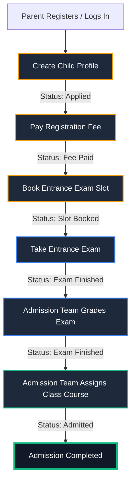

# 🏫 ABC International School Admission Management System

A full-stack, monorepo application designed to manage student admissions, registration fee transactions, entrance exam slot scheduling, academic grading, and classroom placements.

---

## 🗺️ Student Admission Pipeline

Below is the state-machine workflow that governs each student application. Every transition is protected by backend validators and database lock guards:



---

## ✨ Features & Enhancements

### 👨‍👩‍👧‍👦 Parent Portal
- **Dashboard Overhaul**: Displays initials-based double-character child avatars (e.g. `JA` for Jaseer) inside modern golden gradient cards.
- **Status Detail Panels**: Shows detailed status banners indicating next steps, exam scores (`88/100`), or final classroom placements (e.g. `Grade 2`).
- **Interactive Metric filters**: Features a grid of six metric count summary cards. Clicking any card (e.g. *Applied*, *Slot Booked*) filters the dashboard application list in real-time.
- **Real-Time Exam Scheduling**: Maps booked session IDs to resolve and display the exact exam date, time, and AM/PM directly on the parent's home screen.
- **Legible Forms**: Fixed default browser styling behaviors on Gender and Grade drop-downs to ensure clear, high-contrast text on dark backgrounds.

### 🛡️ Admission Team Portal
- **Application Workspaces**: Filter applications by status to review bios, grade exams, and assign courses.
- **Multi-Seat Slot Management**: Supports multi-seat capacities for exam slots. Fully custom edit and delete actions are available for unreserved slots.
- **AM/PM 12-Hour Dropdowns**: Time inputs are configured via dedicated selection dropdowns (Hour, Minute, AM/PM) to prevent manual string input errors.
- **Lock Guards**: Automatically locks exam slots (`🔒 Locked`) and prevents deletion/editing once all seats of that capacity have been booked.

### 🌐 Cross-Cutting Architecture
- **Edge Routing & Guards**: Protected dashboard pages redirect unauthenticated users to `/login`. Already logged-in users navigating to `/login` or `/` are automatically bounced to their workspace dashboard.
- **Session Handling**: HTTP-Only session cookies manage user auth tokens. Logging out clears the session and returns users directly to the school's **root landing page (`/`)**.
- **Offline Reliability**: Replaced remote Next.js font packages with local system fallback fonts to ensure clean builds in offline compile environments.

---

## 🛠️ Tech Stack
- **Frontend**: Next.js 16 (App Router), React, Tailwind CSS, TypeScript, Mongoose models integration.
- **Backend**: NestJS, TypeScript, MongoDB (via Mongoose), Passport JWT.
- **Database**: MongoDB.

---

## 📂 Directory Structure
```
Student-Admission/
├── README.md                 # Project documentation (this file)
├── package-lock.json         # Root lockfile
├── backend/                  # NestJS API Backend Service
│   ├── src/
│   │   ├── modules/          # Auth, Users, Students, Exam-Slots modules
│   │   ├── seed.ts           # Seeder script for default data & users
│   │   └── main.ts           # NestJS Server entrypoint
│   └── tsconfig.json         # Backend TS configs
└── frontend/                 # Next.js App Router Client Portal
    ├── src/
    │   ├── app/              # Portal pages & layouts
    │   ├── components/       # Common elements (Navbar, layout modules)
    │   └── context/          # React Context providers (AuthContext)
    └── tailwind.config.ts    # Frontend theme definitions
```

---

## 🚀 Getting Started

### Prerequisites
- **Node.js** (v18 or higher recommended)
- **MongoDB** running locally on port `27017` (or remote Mongo Connection URI)

---

### 1. Backend Setup

1. Navigate to the backend directory:
   ```bash
   cd backend
   ```

2. Install dependencies:
   ```bash
   npm install
   ```

3. Setup environment variables:
   Create a `.env` file from the example:
   ```bash
   cp .env.example .env
   ```
   *Example variables:*
   ```env
   PORT=3001
   MONGO_URI=mongodb://localhost:27017/student-admission
   JWT_SECRET=super-secret-key-change-this-in-production
   ```

4. Seed the database with the initial Admission Team user:
   ```bash
   npm run db:seed
   ```
   *Seeded admin credentials:*
   - **Email:** `admin@school.com`
   - **Password:** `AdminPass123!`
   - **Role:** `admission_team`

5. Start the backend development server:
   ```bash
   npm run start:dev
   ```
   - **REST API URL:** `http://localhost:3001/api`
   - **Swagger OpenAPI Docs:** `http://localhost:3001/api/docs`

---

### 2. Frontend Setup

1. Navigate to the frontend directory:
   ```bash
   cd ../frontend
   ```

2. Install dependencies:
   ```bash
   npm install
   ```

3. Setup environment variables:
   Create a `.env` file:
   ```bash
   cp .env.example .env
   ```

4. Start the frontend development server:
   ```bash
   npm run dev
   ```
   - **School Web Portal:** `http://localhost:3000`

---

## 🔒 State-Machine Guard Assertions (NestJS)

To guarantee database integrity, the backend rejects out-of-order calls with `400 Bad Request` or `403 Forbidden` API exceptions:

1. **Fee Payment Lock**: Biographical modifications (`PATCH /students/:id`) are locked once the registration fee is paid.
2. **Scheduling Prerequisite**: Exam slot booking requests are rejected if the registration fee has not yet been paid.
3. **Double Booking Guards**: Re-booking an exam slot is rejected if the student has already scheduled one.
4. **Grading Gatekeepers**: Grader endpoints reject scores if the student's status is not `SLOT_BOOKED`.
5. **Classroom Assignments**: Placement selections are rejected if the exam score is missing or incomplete.
6. **Multi-Seat Transaction Safety**: Slots use MongoDB `$push` atomic filters on `bookedStudentIds` to safely update occupancy ratios without concurrency overlaps.
